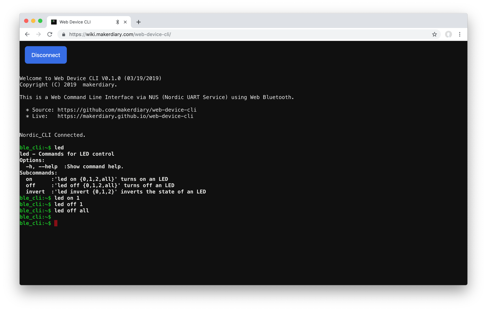

# Web Device CLI

A Web Command Line Interface via NUS (Nordic UART Service) using [Web Bluetooth](https://webbluetoothcg.github.io/web-bluetooth/).

[](https://youtu.be/i6OgX4civrM)

## Prerequisites

* nRF52 based board, see [Supported Boards](#supported-boards) for more information 
* A Web Bluetooth enabled [browser](https://github.com/WebBluetoothCG/web-bluetooth/blob/master/implementation-status.md): Chrome 56+, etc.
* [BLE CLI firmware](./firmware) with NUS enabled

## Try it out
This repo has a live web page hosted here:

**[https://makerdiary.github.io/web-device-cli](https://makerdiary.github.io/web-device-cli)**

## Flashing CLI firmware

The pre-built CLI firmwares can be found in the [firmware](./firmware) folder. Follow the commands below to flash the firmware:

```
# For nRF52832-MDK board
pyocd flash -t nrf52 ble_app_cli_nrf52832_mdk_s132.hex

# For nRF52840-MDK board
pyocd flash -t nrf52840 ble_app_cli_nrf52840_mdk_s140.hex

# For nRF52840-MDK USB Dongle
nrfutil dfu usb-serial -pkg s140_nrf52_6.1.0_softdevice_dfu_pkg.zip -p <Serial port>
nrfutil dfu usb-serial -pkg ble_app_cli_nrf52840_mdk_usb_dongle_app.zip -p <Serial port>

# For Pitaya Go board
nrfutil dfu usb-serial -pkg s140_nrf52_6.1.0_softdevice.zip -p <Serial port>
nrfutil dfu usb-serial -pkg pitaya_cli_v1.0.0.zip -p <Serial port>

```

## Building CLI firmware

The BLE CLI source code is located here. You can check it out and build your own firmware:

* [nrf52832-mdk/ble_app_cli](https://github.com/makerdiary/nrf52832-mdk/tree/master/examples/nrf5-sdk/ble_app_cli)
* [nrf52840-mdk/ble_app_cli](https://github.com/makerdiary/nrf52840-mdk/tree/master/examples/nrf5-sdk/ble_app_cli)
* [nrf52840-mdk-usb-dongle/ble_app_cli](https://github.com/makerdiary/nrf52840-mdk-usb-dongle/tree/master/examples/nrf5-sdk/ble_app_cli)
* [pitaya-go/pitaya-cli](https://github.com/makerdiary/pitaya-go/tree/master/examples/pitaya_cli)

See [this post](https://blog.makerdiary.com/how-to-use-nrf5-sdk-with-arm-gcc/) to set up your development environment with nRF5 SDK and ARM GCC.


## Supported Boards
We are continually adding board-specific support as documented below.

* [nRF52832-MDK](https://wiki.makerdiary.com/nrf52832-mdk)
* [nRF52840-MDK](https://wiki.makerdiary.com/nrf52840-mdk/)
* [nRF52840-MDK USB Dongle](https://wiki.makerdiary.com/nrf52840-mdk-usb-dongle)
* [Pitaya Go](https://wiki.makerdiary.com/pitaya-go)

## Contributing
We would love for you to contribute to this project and help make it even better than it is today.

## MIT License

Copyright (c) 2019 makerdiary

Permission is hereby granted, free of charge, to any person obtaining a copy
of this software and associated documentation files (the "Software"), to deal
in the Software without restriction, including without limitation the rights
to use, copy, modify, merge, publish, distribute, sublicense, and/or sell
copies of the Software, and to permit persons to whom the Software is
furnished to do so, subject to the following conditions:

The above copyright notice and this permission notice shall be included in all
copies or substantial portions of the Software.

THE SOFTWARE IS PROVIDED "AS IS", WITHOUT WARRANTY OF ANY KIND, EXPRESS OR
IMPLIED, INCLUDING BUT NOT LIMITED TO THE WARRANTIES OF MERCHANTABILITY,
FITNESS FOR A PARTICULAR PURPOSE AND NONINFRINGEMENT. IN NO EVENT SHALL THE
AUTHORS OR COPYRIGHT HOLDERS BE LIABLE FOR ANY CLAIM, DAMAGES OR OTHER
LIABILITY, WHETHER IN AN ACTION OF CONTRACT, TORT OR OTHERWISE, ARISING FROM,
OUT OF OR IN CONNECTION WITH THE SOFTWARE OR THE USE OR OTHER DEALINGS IN THE
SOFTWARE.